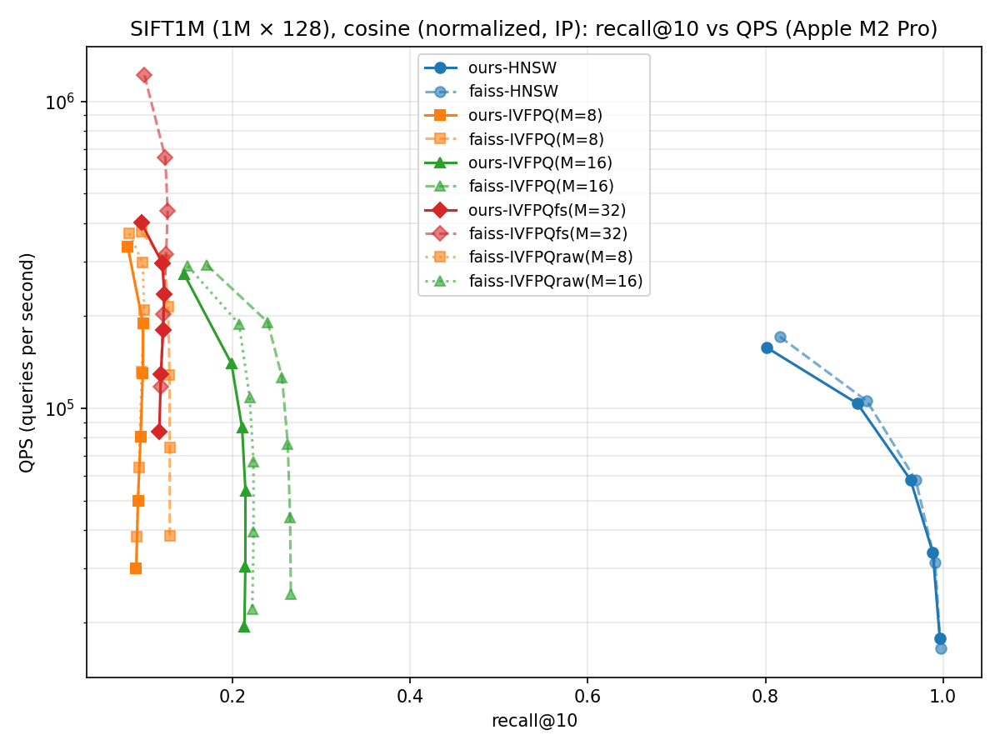

# Proxima

I wrote HNSW and IVF-PQ vector indexes by hand in C++17, with NumPy-friendly
Python bindings on top. I built it to learn how production ANN libraries
(FAISS, hnswlib, ScaNN) work underneath, so it is not a drop-in replacement
for any of them.

## API keys

None. Proxima builds and runs offline. The only optional downloads are the
SIFT1M and GIST1M benchmark datasets, and neither needs a key.

## What's in here

| Index       | Algorithm                                     | Build  | Memory          |
| ----------- | --------------------------------------------- | ------ | --------------- |
| `FlatIndex` | brute-force linear scan (recall ground truth) | O(1)   | `n·d·4` bytes   |
| `HnswIndex` | hierarchical NSW (Malkov & Yashunin 2016)     | O(n log n), parallel | ~`n·d·4 + n·M·8` bytes |
| `IvfPqIndex`| inverted file + product quantization          | O(n·k·iter) train, parallel | ~`n·M` bytes (codes) |
| `IvfPqFastScan` | 4-bit PQ scanned with NEON `tbl` (lossless filter + exact re-rank) | same | ~`n·M/2` bytes |

Distance kernels: `l2sq` and `dot` with hand-unrolled NEON intrinsics on Apple
Silicon (single-pair and 4-candidate batch variants), scalar fallback
elsewhere. Construction is multi-threaded end-to-end: HNSW inserts in
parallel with hnswlib-style per-node locking, IVF-PQ parallelizes k-means
assignment, PQ codebook training, and encoding.

Deletes: every index supports `remove_ids(labels)`. Labels are stable
across removals and never reused (assignment runs off a monotonic counter,
not the live count, which is the classic add-after-remove collision). Flat
and the IVF-PQ family compact physically. HNSW uses hnswlib-style tombstones:

deleted nodes keep routing traffic (cutting edges would shred graph
connectivity) but cannot enter the result set, and `search_layer`'s
termination bound only engages once `ef` *live* results exist, so search
digs past arbitrarily many tombstones. Post-delete recall on survivors
measures ≥0.85 after deleting 30% of a graph. File formats bump (Flat v2:
explicit labels; HNSW v2: tombstone bitmap); v1 files still load.

Updates: every index supports `update(labels, vectors)`, which replaces
the vectors stored under existing labels without changing the labels. A
batch is checked up front: an unknown or removed label raises `KeyError`,
a duplicate raises `ValueError`, and nothing is modified. Flat overwrites
in place. IVF-PQ re-encodes, and a vector whose coarse assignment changed
moves to its new list with its label. HNSW follows hnswlib's `updatePoint`:
the node keeps its id and level, each of its neighbors re-selects its
edges from the two-hop neighborhood, and the node is then re-linked the
way an insert would. After rewriting 30% and then 100% of a 2k-vector
graph, recall@10 matches a fresh build of the same data (0.99 vs 0.99,
200 queries, d=32). No format change: an updated index saves and loads as before.

Metrics: every index supports `metric="l2"` and `metric="ip"` (inner
product). For cosine similarity, normalize vectors and queries. On unit
vectors L2 ranks exactly like cosine (‖q−x‖² = 2 − 2·cos), and for IVF-PQ
the choice matters: use `metric="l2"`. The L2 path PQ-encodes residuals
from the coarse centroid while the IP path encodes raw vectors
(`by_residual=False` in FAISS terms), and on normalized SIFT1M that is
recall@10 0.546 vs 0.213 (M=16, nprobe=64). Flat and HNSW score exactly,
so either metric works for them. For raw inner product (MIPS) the ADC
table depends only on the query, built once with zero per-probe table
work, and the fast-scan variant quantizes once per query too.

Inner-product IVF-PQ trails `faiss.IndexIVFPQ` on real data, on both
recall and QPS; see [Inner product on SIFT1M](#inner-product-on-sift1m).
An earlier version of this README said it beat FAISS on both axes. That
came from a 50k-vector Gaussian synthetic set and does not hold on SIFT1M.

## Build

```bash
git clone https://github.com/shivaskumar01/proxima.git && cd proxima
python3 -m venv .venv
.venv/bin/pip install numpy faiss-cpu pybind11 pytest matplotlib
cmake -S . -B build -DPython3_EXECUTABLE=$(pwd)/.venv/bin/python
cmake --build build -j
.venv/bin/python -m pytest tests/ -v
```

The compiled extension lands in `python/proxima/_proxima.*.so`. The Python
shim (`python/proxima/__init__.py`) re-exports the four index classes, so
benchmarks and tests just `from proxima import HnswIndex`.

## Use

```python
import numpy as np
from proxima import HnswIndex, IvfPqIndex

xb = np.random.randn(100_000, 128).astype("float32")
xq = np.random.randn(100, 128).astype("float32")

# HNSW
idx = HnswIndex(dim=128, metric="l2", M=16, ef_construction=200)
idx.add(xb)
D, I = idx.search(xq, k=10, ef=64)

# IVF-PQ
ivf = IvfPqIndex(dim=128, nlist=1024, M=8)
ivf.train(xb[:50_000])
ivf.add(xb)
D, I = ivf.search(xq, k=10, nprobe=8)

# Cosine: normalize, then use metric="l2" for IVF-PQ. Same ranking as
# cosine on unit vectors, ~2.5x the recall of metric="ip" on SIFT1M.
# D is squared L2, so cosine = 1 - D/2. Flat/HNSW can use either metric.
xn = xb / np.linalg.norm(xb, axis=1, keepdims=True)
cos = IvfPqIndex(dim=128, nlist=1024, M=8, metric="l2")
cos.train(xn[:50_000]); cos.add(xn)

# Raw inner product (MIPS): metric="ip", D returns dot products, descending.
# Every index takes the same kwarg.
ip = IvfPqIndex(dim=128, nlist=1024, M=8, metric="ip")
ip.train(xb[:50_000]); ip.add(xb)

# Deletes: labels are stable and never reused. HNSW marks tombstones
# (nodes keep routing, memory not reclaimed); the others compact physically.
removed = ivf.remove_ids(np.array([3, 17, 42], dtype=np.int64))

# Updates: replace vectors in place, same labels. The whole batch is
# rejected (KeyError / ValueError) if any label is unknown or repeated.
idx.update(np.array([5, 9], dtype=np.int64), xb[:2] + 0.1)

# Persistence, round-trip preserves search results bit-for-bit.
idx.save("hnsw.bin")
loaded = HnswIndex.load("hnsw.bin")
```

## Benchmarks

```bash
.venv/bin/python benchmarks/bench.py --dataset synthetic --n 100000 --d 128
.venv/bin/python benchmarks/sift_loader.py --download   # 161 MB
.venv/bin/python benchmarks/bench.py --dataset sift1m
.venv/bin/python benchmarks/plot_results.py --dataset sift1m
.venv/bin/python benchmarks/plot_results.py --dataset sift1m --metric cosine
.venv/bin/python benchmarks/plot_results.py --dataset sift1m --metric ip
.venv/bin/python benchmarks/cosine_check.py              # l2 vs ip for cosine
.venv/bin/python benchmarks/gist_loader.py --download   # ~2.6 GB, harder dataset
.venv/bin/python benchmarks/plot_results.py --dataset gist1m
```

CI builds and tests five flavors on every push: `macos-14` (NEON),
`macos-14` with `-DPROXIMA_FORCE_SCALAR=ON`, and x86 `ubuntu` (scalar) run
the pytest suite; two more (`-DPROXIMA_ASAN=ON`, NEON and scalar) build
`tests/cpp/asan_smoke.cpp` and drive every index through
add/remove/re-add/search/save-load under AddressSanitizer. The scalar
fallbacks had never been compiled before the matrix existed, and the v5
zero-length-buffer segfault would have tripped the ASan jobs, both are
exactly how this class of bug hides.

`plot_results.py` re-execs itself once per series so each sweep runs in its
own process: load → build one index → measure → merge into the JSON → exit.
Together with memmap-chunked loaders (`fvecs_chunks`) this caps peak RSS at
roughly base+index for one series (~5 GB on GIST1M). The earlier all-in-one
harness held every numpy temporary and index in a single process and pushed
a 16 GB machine into compressed-swap thrash on GIST1M, an hour inside the
memory compressor at "760% CPU" with an 8 MB resident set, zero builds
finished. If a benchmark machine looks busy but makes no progress, check
`vm.swapusage` before blaming the code. `bench.py` still loads datasets
whole; keep it to SIFT-scale on 16 GB machines.

### SIFT1M (1M × 128, Apple M2 Pro, std::thread parallel search)


Honest read of the chart (all cells from one run of the per-series
harness on 2026-09-24, 10k queries, each series in its own process, 15s
thermal settle after each build; expect ±10% run-to-run movement on
individual QPS cells):
- HNSW (blue): ours runs 0.93-0.98× FAISS QPS at efSearch ≤ 64 and is
  ahead at high efSearch (1.06-1.11× at efS≥128; an earlier June run
  measured 1.13-1.20×). Before the batch distance kernels this was
  0.73-0.81× across the board.
- HNSW build: 41.7s vs FAISS's 45.3s for 1M vectors, the lock-based
  parallel build is slightly *faster* than FAISS, down from 342s
  single-threaded.
- IVF-PQ M=16 (green) is ahead at nprobe=1 and slightly behind above it,
  see below. M=8 is at parity at nprobe=1 and 0.77-0.89× above it.
- Fast-scan (red): our lossless-filter variant reaches recall FAISS's
  lossy fast-scan cannot (0.452 vs a 0.406 ceiling) at 0.38-0.58× its raw
  QPS, a deliberate trade, dissected below.

HNSW (M=16, efConstruction=200; build 41.7s ours / 45.3s FAISS; ours was
342s before the parallel build):

| efSearch | recall@10 ours / FAISS | QPS ours / FAISS | ours/FAISS |
| -------- | ---------------------- | ---------------- | ---------- |
| 16   | 0.802 / 0.818 | 156.7k / 169.0k | 0.93 |
| 32   | 0.903 / 0.915 |  99.0k / 103.5k | 0.96 |
| 64   | 0.964 / 0.970 |  56.5k /  57.4k | 0.98 |
| 128  | 0.990 / 0.992 |  33.2k /  31.2k | 1.06 |
| 256  | 0.997 / 0.998 |  18.2k /  16.3k | 1.11 |

IVF-PQ with precomputed ADC tables (nlist=1000; ours train+add on 1M
vectors: 2.6-4.0s):

| M  | nprobe | recall@10 ours / FAISS | QPS ours / FAISS | ours/FAISS |
| -- | ------ | ---------------------- | ---------------- | ---------- |
| 8  |  1     | 0.229 / 0.227 | 407.2k / 407.6k | 1.00 |
| 8  |  8     | 0.347 / 0.347 | 168.7k / 205.9k | 0.82 |
| 8  | 32     | 0.360 / 0.359 |  59.9k /  67.5k | 0.89 |
| 8  | 64     | 0.360 / 0.360 |  30.9k /  36.2k | 0.85 |
| 16 |  1     | 0.296 / 0.294 | 345.1k / 282.8k | 1.22 |
| 16 |  8     | 0.514 / 0.512 | 118.7k / 121.1k | 0.98 |
| 16 | 32     | 0.546 / 0.545 |  37.2k /  40.0k | 0.93 |
| 16 | 64     | 0.548 / 0.548 |  19.4k /  22.4k | 0.87 |

4-bit fast-scan, 16-byte codes (same byte budget as M=16 above):

| nprobe | recall@10 ours / FAISS | QPS ours / FAISS |
| ------ | ---------------------- | ---------------- |
|  1     | 0.265 / 0.238 | 428.1k / 1139.2k |
|  8     | 0.430 / 0.386 | 249.2k /  452.0k |
| 64     | 0.452 / 0.406 |  66.5k /  115.5k |

Recall matches FAISS within 0.003 in every 8-bit cell. Algorithm and
quantization are correct end-to-end on a real dataset. The batch kernels
are verified bit-identical to the single-pair kernels (800k-pair check, 0
mismatches) now that `-ffast-math` is gone.

HNSW QPS: 0.93-0.98× FAISS at low/mid efSearch, 1.06-1.11× above it at
high efSearch. Recall trails by 0.016 at efS=16 and converges to within
0.001 by efS=256. The batch kernels (`l2sq_x4` over gathered neighbor
batches) closed the old 19-27% gap; the remaining low-ef difference tracks
graph-layout differences (flat link arrays vs vector-of-vectors), not
distance math.

IVF-PQ M=16 is faster than FAISS at nprobe=1 (1.13-1.22× across three
runs) and 0.83-0.98× at nprobe ≥ 4. The June run had it at or above FAISS
at every nprobe (1.01-1.29×); three runs on 2026-09-24 did not reproduce
that above nprobe=1, with FAISS's own QPS measuring higher than in June on
the same faiss-cpu 1.13.2. The precomputed-table expansion is what took
M=16 from a clear high-nprobe deficit to near parity. M=8 sits at
0.77-1.00×; its cheaper per-code scan makes it relatively more scan-bound,
where FAISS's in-register code layout still has an edge.

Fast-scan splits along its design trade. FAISS's 4-bit scan returns
quantized distances and is 1.7-2.7× faster; ours filters with quantized
underestimates and re-scores survivors exactly, ending with strictly
better recall at every operating point, FAISS's recall *ceiling* here is
0.406 while ours reaches 0.452 from identical codes. At the same byte
budget, our fast-scan also runs ~1.5× the QPS of our own 8-bit M=16 at
nearby recall (0.430 @ 249.2k vs 0.466 @ 162.0k).

M=16 doubles the code budget and lifts recall from 0.36 → 0.55 at the same
nprobe, validating the recall-vs-memory tradeoff.

### Inner product on SIFT1M

Two variants of SIFT1M, both searched by inner product:
- **cosine**: base and queries L2-normalized, `metric="ip"`
- **raw IP**: the vectors as stored (maximum inner product search)

Ground truth is exact top-100 from `faiss.IndexFlatIP`, cross-checked
against our `FlatIndex` on 200 queries (0.9995 and 1.0000 agreement; the
one cosine mismatch is a float near-tie). FAISS's `IndexIVFPQ` defaults to
`by_residual=True` even for inner product, while ours encodes raw vectors,
so the harness also runs FAISS with `by_residual=False`: the same design
as ours, which separates implementation from encoding choice.



Cosine, IVF-PQ (nlist=1000; 10k queries):

| M  | nprobe | recall@10 ours / FAISS / FAISS raw | QPS ours / FAISS / FAISS raw |
| -- | ------ | ---------------------------------- | ---------------------------- |
| 8  |  1     | 0.081 / 0.097 / 0.083 | 337.0k / 375.1k / 371.8k |
| 8  |  8     | 0.099 / 0.127 / 0.100 | 130.1k / 213.5k / 208.5k |
| 8  | 64     | 0.091 / 0.129 / 0.092 |  30.0k /  38.4k /  38.2k |
| 16 |  1     | 0.145 / 0.170 / 0.149 | 273.0k / 293.3k / 290.5k |
| 16 |  8     | 0.210 / 0.255 / 0.219 |  86.2k / 126.1k / 108.0k |
| 16 | 64     | 0.213 / 0.265 / 0.222 |  19.4k /  24.8k /  22.1k |

Our inner-product IVF-PQ is behind `faiss.IndexIVFPQ` on both recall and
QPS here. Against FAISS configured like ours (raw) the recall gap shrinks
to at most 0.009, but QPS stays at 0.61-0.94×. More k-means iterations
(25 vs 15) do not move our recall. Raw IP (`results_sift1m_ip.png`) has
the same shape: 0.000-0.008 lower recall than either FAISS variant, and
0.60-0.86× the QPS. SIFT descriptors all have similar norms, so raw IP
ranks almost like cosine.

The other indexes hold up under inner product. HNSW stays within 0.017
recall of FAISS and runs 0.92-1.14× its QPS, ahead from efS=64 in the raw
run and from efS=128 in the cosine run. Fast-scan is within 0.004 recall
at 0.33-0.74× QPS.

For cosine, the fix is to not use inner product on IVF-PQ at all
(`benchmarks/cosine_check.py`, recall@10 against the cosine ground truth):

| SIFT1M normalized, M=16 | nprobe=8 | nprobe=64 |
| ----------------------- | -------- | --------- |
| ours, `metric="ip"` | 0.210 | 0.213 |
| FAISS IP (default, residual) | 0.255 | 0.265 |
| ours, `metric="l2"` | 0.511 | 0.546 |
| FAISS L2 | 0.512 | 0.548 |

On unit vectors L2 order is cosine order, and the L2 path encodes residuals
from the coarse centroid, a far smaller target for 256 codewords per
subspace than the whole vector. That is 2.5× the recall of the IP path at
the same code size, matching FAISS.

### GIST1M (1M × 960, harder dataset)

SIFT1M is the easy benchmark. GIST1M is the harder one: 7.5× higher
dimensionality, less cluster structure, and recall ceilings that drop sharply
for both implementations. I run it as a credibility check, since tricks that
work on SIFT1M don't always survive at 960-dim.


HNSW (M=16, efConstruction=200; build 239s ours / 235s FAISS, at parity.
A June run measured 275s / 406s, when FAISS's build was the one fighting
memory pressure on a 16 GB machine):

| efSearch | recall@10 ours / FAISS | QPS ours / FAISS | ours/FAISS |
| -------- | ---------------------- | ---------------- | ---------- |
| 16  | 0.489 / 0.508 | 28.1k / 30.1k | 0.94 |
| 32  | 0.627 / 0.651 | 17.3k / 18.1k | 0.95 |
| 64  | 0.753 / 0.776 | 11.1k / 11.0k | 1.01 |
| 128 | 0.856 / 0.867 |  6.5k /  6.4k | 1.02 |
| 256 | 0.927 / 0.929 |  3.7k /  3.5k | 1.04 |

HNSW is at parity with FAISS on GIST, 0.94-1.04× across the sweep (1,000
queries), within 0.024 recall everywhere (the lower absolute
recall ceiling vs SIFT is the dataset: nearest-neighbor structure at
960-dim is fundamentally harder). Pre-v3 this was 3-20% behind at every
point; the batch kernels matter *more* at 960-dim because each gathered
neighbor batch amortizes 4× more query-load traffic.

IVF-PQ with precomputed ADC tables (nlist=1000; ours train+add 18-23s,
FAISS 10-13s):

| config | recall@10 ours / FAISS | QPS ours / FAISS | ours/FAISS |
| ------ | ---------------------- | ---------------- | ---------- |
| M=8,  nprobe=1  | 0.074 / 0.075 |  88.5k / 169.6k | 0.52 |
| M=8,  nprobe=8  | 0.093 / 0.098 |  58.5k /  96.0k | 0.61 |
| M=8,  nprobe=64 | 0.093 / 0.099 |  16.1k /  21.2k | 0.76 |
| M=16, nprobe=1  | 0.111 / 0.112 |  84.7k / 109.8k | 0.77 |
| M=16, nprobe=8  | 0.157 / 0.165 |  43.9k /  63.2k | 0.69 |
| M=16, nprobe=64 | 0.161 / 0.169 |  10.8k /  13.0k | 0.83 |

4-bit fast-scan, 16-byte codes:

| nprobe | recall@10 ours / FAISS | QPS ours / FAISS |
| ------ | ---------------------- | ---------------- |
|  1     | 0.101 / 0.059 | 81.9k / 280.2k |
|  8     | 0.126 / 0.076 | 76.0k / 210.4k |
| 64     | 0.128 / 0.073 | 13.4k /  55.5k |

IVF-PQ recall matches FAISS within 0.01 in every 8-bit cell, at 0.52-0.83×
FAISS's QPS (0.66-0.72× in the June run), with no single structural cliff
left. Two fixes got it from far behind to there: the precomputed-table
expansion (+45% to +185% at nprobe≥4, removing the per-probe `dsub` term)
and the slab-batched 4q×4c register-tiled coarse scan (+20% to +61% at low
nprobe, where 1000 × 960-dim distances per query had been pure bandwidth).
The batching is gated on coarse-scan volume (≥1 MB per query): at SIFT's
128-dim it measurably *hurts*, the coarse-matrix round-trip costs more
than the 4× traffic saving, so SIFT keeps the inline per-query path.

The fast-scan numbers are the dataset's verdict on lossy scanning. At
960-dim the ADC distance spread is small relative to a uint8 quantization
step, and FAISS's quantized-distance fast-scan pays for it: recall *drops*
to 0.059-0.076, 16-byte fast-scan codes scoring *worse* than its own
8-byte M=8 ordinary PQ (0.075-0.099). Our lossless-filter design holds
0.101-0.128, roughly the recall of ordinary M=8/M=16 PQ, at QPS in the
range of our 8-bit scans. FAISS is 2.2-4.2× faster in raw QPS, but at a
recall level this dataset makes useless.

The recall ceiling at ~0.16 (M=16, full scan) is what 240× compression buys
on 960-dim GIST descriptors: PQ throws away too much to recover much
beyond that.
This is the dataset, not a bug, FAISS plateaus at the same place.

> Bug found while benching GIST1M: my IVF-PQ `encode_vector` had a
> fixed `float r_sub[64]` stack array, which silently overflowed at
> dsub > 64. SIFT1M (dsub ≤ 32) never tripped it; GIST1M with M=8
> (dsub=120) did. Caught by macOS stack canary → SIGABRT. Fixed by passing
> a heap-allocated scratch buffer from `add()`. Regression test now exercises
> dsub=120 explicitly.

> Bug #2, also courtesy of GIST1M: the parallel HNSW build hung forever
> on GIST, one worker spinning at 100% in greedy descent, every other
> worker finished. Root cause: `-ffast-math` let the compiler reassociate
> the single-pair (`l2sq`) and batched (`l2sq_x4`) kernels differently, so
> the *same* pair of vectors got distances a few ulps apart (~5% of pairs)
> depending on which kernel evaluated it. Greedy descent recomputed `best`
> with the single kernel but scored neighbors with the batched one; on
> near-tied pairs the inconsistent comparisons satisfied "A is closer than
> B" *and* "B is closer than A", and the walk ping-ponged forever. GIST has
> ~1% exact-duplicate descriptors, near-ties everywhere, while SIFT1M
> never produced one in a million inserts. Fixed twice over: greedy descent
> now carries `best` forward (a strictly-decreasing scalar terminates under
> ANY kernel disagreement), and `-ffast-math` is gone (kernels verified
> bit-identical on 800k pairs, 0 mismatches). A duplicate-heavy regression
> test runs the build in a child process with a deadline. Lesson: never let
> a loop's termination depend on two code paths rounding identically.

## Architecture

### HNSW (`src/hnsw.cpp`)

- Storage: `data_[id*dim..(id+1)*dim]` for vectors, `links_[id][layer]`
  for neighbor IDs. Entry point and max level updated only when a node draws a
  level above the current max.
- Insertion: greedy descent from entry point through layers above the new
  node's level, then beam search (`ef_construction`) at each lower layer.
  Bidirectional links added; receiving nodes get re-pruned to `M_max` if they
  overflow.
- Parallel build (hnswlib-style): `add()` appends vectors and draws
  levels serially up front (so `data_` never reallocates under workers and
  the level sequence stays seed-deterministic), then inserts the batch in
  parallel. One `std::mutex` per node guards its link lists; traversal
  copies a node's neighbor list under its lock, then computes distances
  lock-free. A global entry mutex guards `entry_point_`/`max_level_` and is
  held across a whole insertion only for the ~log_M(n) nodes that raise the
  max level. Lock order is one node lock at a time, entry never acquired
  while holding a node lock, no cycles. Batches under 256 nodes take the
  serial path so streaming one-at-a-time adds don't pay for mutex setup.
  Link structure depends on insertion interleaving, so a parallel build is
  not bit-reproducible run-to-run, recall is unaffected (measured spread
  ~0.003 across rebuilds), and the level distribution *is* deterministic.
- Neighbor selection: heuristic from Algorithm 4 in the paper (a candidate
  is accepted only if it's closer to the query than to every already-accepted
  neighbor, kills near-duplicate edges).
- Search: greedy descent through upper layers, then `search_layer` at
  level 0 with `ef`. Returns top-k from a max-heap. Quiescent-index search
  takes no locks (concurrent search+add is not supported).
- Visited set: single buffer + monotonic generation counter. Bumping the
  counter resets all marks in O(1) (vs O(n) memset per query).

### IVF-PQ (`src/ivfpq.cpp`)

- Train: k-means on raw vectors → `nlist` coarse centroids. Compute
  residuals `r = x - centroid(x)`. For each of `M` subspaces, run k-means with
  `KSUB=256` on the `dsub`-dim slice → `M` codebooks of 256 vectors each.
  The coarse k-means parallelizes its assignment step internally; the `M`
  subspace trainings run one-per-thread (with their inner k-means pinned to
  one thread to avoid oversubscription).
- Add: nearest coarse centroid → encode residual into `M` bytes (one per
  subspace) → push (label, code) into the inverted list. Assignment+encode
  runs in parallel into per-vector slots, then lists are appended serially in
  input order, labels and list contents are identical to a serial add.
- Search (ADC with precomputed tables): for each of `nprobe` nearest
  coarse lists, the `M × 256` lookup table comes from the expansion
  `‖(q−c)−r‖² = ‖q−c‖² + (‖r‖² + 2⟨c_m,r⟩) − 2⟨q_m,r⟩`: the middle term is
  precomputed at train time (`nlist × M × 256` floats, 8-16 MB), the last is
  built once per QUERY, and `‖q−c‖²` is the coarse distance the coarse scan
  already produced, folded into subspace 0. The per-probe cost is an
  O(M·256) table merge, the dsub factor (120 on GIST with M=8) is gone,
  which is what used to hand FAISS the GIST IVF-PQ win at every nprobe.
  Each list entry's distance is a sum of `M` lookups. Empty lists are
  skipped before the merge.

### IVF-PQ fast-scan (`src/ivfpq_fs.cpp`)

4-bit PQ scanned with the NEON `tbl` instruction (FAISS's
`IndexIVFPQFastScan` design): KSUB=16 entries per subspace, so at the same
byte budget you run twice the subspaces (M=32 × 4-bit = 16 bytes ≈
M=16 × 8-bit). Codes are nibble-packed in blocks of 16 candidates laid out
so one `vqtbl1q_u8` performs 16 LUT lookups in a single instruction, with
u16 lane accumulators.

The one deliberate departure from FAISS: our per-probe LUT is quantized to
uint8 with floor() against per-subspace minima, making every quantized
score an underestimate of the exact ADC distance. The SIMD pass is
therefore a *lossless filter*, a lane is discarded only when even its
underestimate cannot beat the current top-k, and survivors are re-scored
against the exact float LUT. FAISS instead returns the quantized distances
directly: faster (no re-rank, SIMD top-k inside blocks), but lossy, and
the loss is visible in the benchmarks below, dramatically so at 960-dim
where distance spreads are small relative to the quantization step.

### k-means (`src/kmeans.cpp`)

Lloyd's algorithm with k-means++ seeding. Empty-cluster re-seeding from a
random data point each iteration. Double-precision sum accumulators
(centroid drift becomes visible at ~10K updates with float32).

The O(n·k·dim) assignment step and the k-means++ min-distance refreshes are
parallelized; both are per-point independent, so the result is identical for
any thread count. The sampling scan and the update step stay serial, a
parallel float reduction would change summation order and break
seed-determinism. `nearest_centroid` scans 4 centroid rows per pass via the
batch kernel.

## SIMD / cache tuning notes

Apple M2 Pro: 4-wide NEON (128-bit), 64KB L1d per P-core, 16MB shared L2.

1. Distance kernels (`src/distance.cpp`): 4-way unrolled with four
independent FMA accumulators. Single-accumulator code stalls on the FMA
latency (~3 cycles); four parallel chains saturate the issue width and let
the OoO engine overlap loads with arithmetic.

```cpp
acc0 = vfmaq_f32(acc0, d0, d0);   // four independent dependency chains
acc1 = vfmaq_f32(acc1, d1, d1);
acc2 = vfmaq_f32(acc2, d2, d2);
acc3 = vfmaq_f32(acc3, d3, d3);
```

For d=128 (16 NEON regs × 16 floats per iter × 8 iters), the inner loop
processes the whole vector in 8 unrolled iterations with no scalar tail.

1b. Batch kernels (`l2sq_x4` / `dot_x4` / `*_ny`), the FAISS
`fvec_L2sqr_batch_4` trick: one query against four candidates in a single
pass. The query block is loaded once per 16 elements instead of four times,
and 4 candidates × 4 chains = 16 live accumulators (~21 of the 32 NEON regs)
give the OoO engine far more ILP than back-to-back single-pair calls. The
per-candidate accumulation order exactly mirrors the single-pair kernel, so
batched results are bit-identical and the two can be mixed freely. Wired
into every one-vs-many hot loop: the flat scan, HNSW neighbor expansion,
k-means assignment, IVF coarse-quantizer scan, and PQ encoding.

2. HNSW gather-then-batch expansion (`src/hnsw.cpp`): each neighbor
expansion is a random ~512-byte load (d=128 floats). `search_layer` first
gathers the unvisited neighbors (issuing a `__builtin_prefetch` per id as it
goes), then computes their distances four at a time with `l2sq_x4`, by the
time the batch kernel runs, the lines are in flight or already in L1. Same
visit order as the one-by-one loop, so heap contents are identical.

3. IVF-PQ LUT layout + vectorized build: `M × 256` floats = 8KB for M=8,
fits comfortably in L1d. Inner loop is `M` constant-stride loads with no
pointer chasing.

The LUT *build* (compute distance from each subspace's residual to all 256
codebook entries) used to dominate IVF-PQ search at high `nprobe`, naively
it's `M × 256` calls to `l2sq`, ~70% of per-query work at nprobe=32. We
vectorize it with a NEON FMA tile pattern:

- A second copy of the codebook is kept transposed: instead of `cb[k][j]`
  (per-centroid, then per-dim) it's `cb_T[j][k]` (per-dim, then per-centroid)
  so all 256 distances stride contiguously.
- The build processes 16 LUT entries at a time, holding 4 NEON accumulators
  in registers across the entire `dsub` reduction, no LUT loads/stores in
  the inner loop.

```cpp
for (k_start = 0; k_start < 256; k_start += 16) {
    float32x4_t lut0..lut3 = zero;          // four parallel chains
    for (j = 0; j < dsub; ++j) {
        float32x4_t r = vdupq_n_f32(r_m[j]);
        // four 4-wide loads from cb_T_m[j*256 + k_start..]
        // four (cb - r) and four FMA into lut0..lut3
    }
    store lut0..lut3 -> LUT[m][k_start..]
}
```

This kicks the LUT build from ~70% of search time down to ~30% on SIFT1M
and roughly doubles IVF-PQ QPS at high nprobe.

4. PQ inverted-list layout + unrolled scan: parallel arrays for labels
and codes. Codes stream contiguously during scan (`n_list × M` byte buffer);
labels are touched only on heap insert. Interleaving (label, code, label,
code) would pollute L1d with `int64` labels during the dominant
code-summation loop.

The scan itself is unrolled four codes wide. A single code's distance is a
serial dependency chain, `M` successive `dist += LUT[m][code[m]]`, each add
waiting on an L1 load. Four independent chains let the core overlap the
lookups (same ILP trick FAISS's 8-bit PQ scanner uses); measured ~+18% IVF-PQ
QPS at high `nprobe` on SIFT1M. Heap updates stay in list order, so results
are unchanged.

5. Visited-set generation counter: mentioned above. The naive approach
of `std::vector<bool> visited(n)` would memset N bytes per query call;
incrementing a `uint32_t` instead is O(1) per query, with a single full
reset only when the counter wraps (~4B searches in).

6. Parallel batch search via std::thread (`include/proxima/parallel.hpp`):
each query is independent; a stride-scheduled `parallel_for` fans out across
`hardware_concurrency()` workers. Per-thread context (HNSW SearchCtx,
IVF-PQ ADC LUT scratch) is built once per worker and reused across that
worker's slice of queries.

We use `std::thread` rather than OpenMP specifically because faiss-cpu
bundles its own libomp; on macOS the dyld refuses to load a second copy and
errors with `OMP: Error #15`. `std::thread` has no such problem and lets us
coexist with FAISS in the same Python process for honest side-by-side
benchmarks.

7. Parallel construction: the same `parallel_for` drives index *builds*.
HNSW inserts with per-node locks (details under Architecture); IVF-PQ
parallelizes coarse k-means assignment, per-subspace codebook training, and
add()-time encoding. SIFT1M HNSW build went from 342s (serial) to ~50s, 
from 7-8× slower than FAISS to the same ballpark, and IVF-PQ train+add of
1M vectors now takes ~3s.

Thermal note for benchmarking: an all-core build right before a search
sweep depresses the first cells by up to ~30% on Apple Silicon.
`plot_results.py` settles 15s after each build so sweep cells are
comparable; treat any future "regression" measured immediately after a
build with suspicion.

### Remaining gap vs FAISS

The v4/v5 items, precomputed ADC tables, the 4-bit `tbl` fast-scan, the
SIMD survivor mask, and the gated query-batched coarse scan, are all in.
What measurably remains:

- Fast-scan raw throughput (ours 0.24-0.58× FAISS): FAISS keeps its
  quantized LUTs pinned in SIMD registers across 32-candidate blocks, does
  its top-k comparisons in SIMD on the quantized values, and never
  re-scores. We added the SIMD survivor mask (a block with no top-k
  candidate costs one compare + one branch; survivors are walked by
  bitmask) which bought +5-17%, but we still reload LUTs per block and
  exact-re-rank survivors. The residual ~2× buys strictly better recall, 
  on GIST, the difference between usable (0.128) and useless (0.073)
  results, and is a trade we keep.
- The coarse-scan tile is volume-gated (`coarse.hpp`): the 4-query ×
  4-centroid register tile wins +20-61% where the scan is bandwidth-bound
  (GIST: 3.8 MB of centroid reads per query) and measurably loses at
  SIFT's 0.5 MB, where the slab round-trip costs more than the 4× traffic
  saving, so the 128-dim regime keeps the inline per-query path. Both
  regimes are covered by tests.
- HNSW runs 0.93-1.11× FAISS across both datasets, ahead at high
  efSearch on SIFT1M; the remaining structural difference is graph
  layout (flat link arrays vs our vector-of-vectors), not distance math.
- 8-bit IVF-PQ on GIST sits at 0.52-0.83× of FAISS with no single
  dominating term left, the residue is FAISS's generally tighter scan
  codegen, not a missing algorithm.
- Inner-product IVF-PQ is 0.60-0.94× FAISS's QPS on SIFT1M and up to
  0.009 below FAISS's raw-encoding recall (0.05 below its default
  residual encoding). For cosine, use `metric="l2"` on normalized vectors.

## Layout

```
proxima/
├── CMakeLists.txt
├── include/proxima/   # public headers
├── src/                # C++ implementations + pybind11 bindings
├── python/proxima/    # Python package; .so lands here after build
├── tests/              # pytest correctness tests vs Flat
└── benchmarks/         # SIFT1M loader + side-by-side FAISS bench
```

## Clean state for distribution

`.gitignore` excludes `build/`, `data/`, `.venv/`, compiled `*.so`,
`__pycache__/`, and `benchmarks/results_*.json`, so a `git clone` is
clean. If you instead `zip` the local working tree, those artifacts will
be included. To wipe them:

```bash
git clean -fdX     # remove every gitignored file (safe; ignores tracked)
```


## References

- Malkov & Yashunin, *Efficient and robust approximate nearest neighbor
  search using Hierarchical Navigable Small World graphs*, TPAMI 2018.
  arXiv:1603.09320
- Jégou, Douze & Schmid, *Product Quantization for Nearest Neighbor Search*,
  TPAMI 2011.
- TexMex SIFT1M corpus: <http://corpus-texmex.irisa.fr/>
