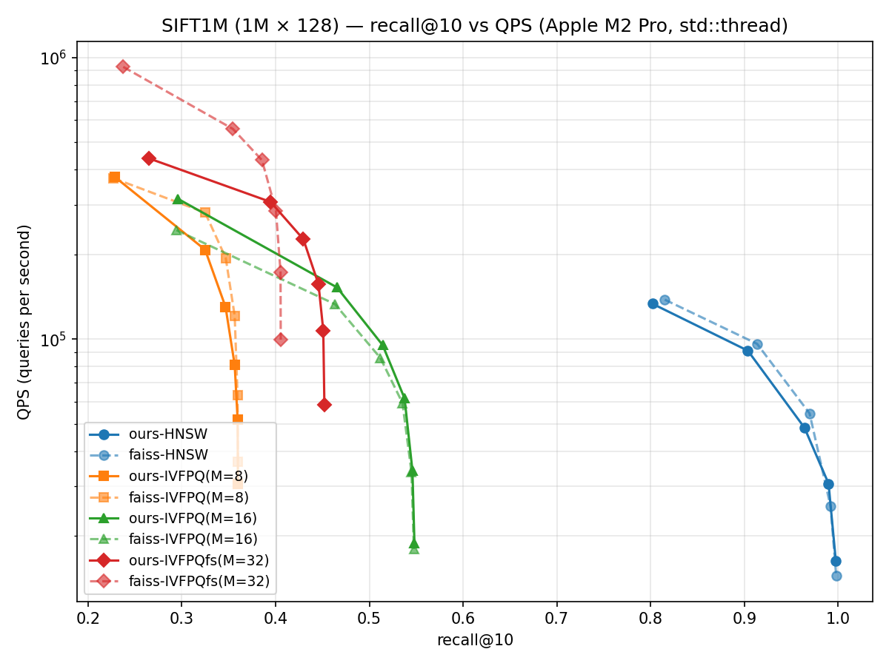
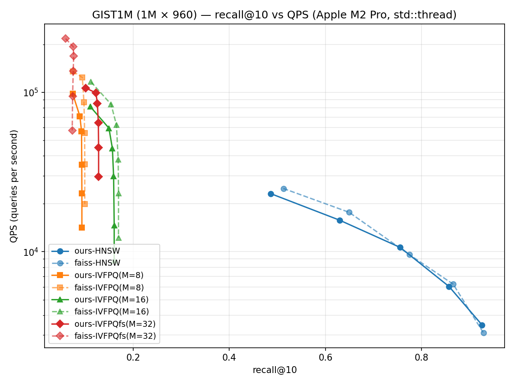

# vectordb

Hand-rolled **HNSW** and **IVF-PQ** vector indexes in C++17 with NumPy-friendly
Python bindings. Built to understand how production ANN libraries (FAISS,
hnswlib, ScaNN) actually work — not as a drop-in replacement for them.

## What's in here

| Index       | Algorithm                                     | Build  | Memory          |
| ----------- | --------------------------------------------- | ------ | --------------- |
| `FlatIndex` | brute-force linear scan (recall ground truth) | O(1)   | `n·d·4` bytes   |
| `HnswIndex` | hierarchical NSW (Malkov & Yashunin 2016)     | O(n log n), parallel | ~`n·d·4 + n·M·8` bytes |
| `IvfPqIndex`| inverted file + product quantization          | O(n·k·iter) train, parallel | ~`n·M` bytes (codes) |
| `IvfPqFastScan` | 4-bit PQ scanned with NEON `tbl` (lossless filter + exact re-rank) | same | ~`n·M/2` bytes |

Distance kernels: `l2sq` and `dot` with hand-unrolled NEON intrinsics on Apple
Silicon (single-pair and 4-candidate batch variants), scalar fallback
elsewhere. Construction is multi-threaded end-to-end: HNSW inserts in
parallel with hnswlib-style per-node locking, IVF-PQ parallelizes k-means
assignment, PQ codebook training, and encoding.

## Build

```bash
cd ~/vectordb
python3 -m venv .venv
.venv/bin/pip install numpy faiss-cpu pybind11 pytest matplotlib
cmake -S . -B build -DPython3_EXECUTABLE=$(pwd)/.venv/bin/python
cmake --build build -j
.venv/bin/python -m pytest tests/ -v
```

The compiled extension lands in `python/vectordb/_vectordb.*.so`. The Python
shim (`python/vectordb/__init__.py`) re-exports the three index classes, so
benchmarks and tests just `from vectordb import HnswIndex`.

## Use

```python
import numpy as np
from vectordb import HnswIndex, IvfPqIndex

xb = np.random.randn(100_000, 128).astype("float32")
xq = np.random.randn(100, 128).astype("float32")

# HNSW
idx = HnswIndex(dim=128, metric="l2", M=16, ef_construction=200)
idx.add(xb)
D, I = idx.search(xq, k=10, ef=64)

# IVF-PQ
ivf = IvfPqIndex(dim=128, nlist=1024, M=8)
ivf.train(xb[:50_000])
ivf.add(xb)
D, I = ivf.search(xq, k=10, nprobe=8)

# Persistence — round-trip preserves search results bit-for-bit.
idx.save("hnsw.bin")
loaded = HnswIndex.load("hnsw.bin")
```

## Benchmarks

```bash
.venv/bin/python benchmarks/bench.py --dataset synthetic --n 100000 --d 128
.venv/bin/python benchmarks/sift_loader.py --download   # 161 MB
.venv/bin/python benchmarks/bench.py --dataset sift1m
.venv/bin/python benchmarks/plot_results.py --dataset sift1m
.venv/bin/python benchmarks/gist_loader.py --download   # ~2.6 GB, harder dataset
.venv/bin/python benchmarks/plot_results.py --dataset gist1m
```

`plot_results.py` re-execs itself once per series so each sweep runs in its
own process: load → build one index → measure → merge into the JSON → exit.
Together with memmap-chunked loaders (`fvecs_chunks`) this caps peak RSS at
roughly base+index for one series (~5 GB on GIST1M). The earlier all-in-one
harness held every numpy temporary and index in a single process and pushed
a 16 GB machine into compressed-swap thrash on GIST1M — an hour inside the
memory compressor at "760% CPU" with an 8 MB resident set, zero builds
finished. If a benchmark machine looks busy but makes no progress, check
`vm.swapusage` before blaming the code. `bench.py` still loads datasets
whole; keep it to SIFT-scale on 16 GB machines.

### SIFT1M (1M × 128, Apple M2 Pro, std::thread parallel search)



**Honest read of the chart** (all cells from one run of the per-series
harness — each series in its own process, 15s thermal settle after each
build; expect ±10% run-to-run movement on individual QPS cells):
- **HNSW (blue):** ours runs 0.89-0.97× FAISS QPS at low/mid efSearch and
  **beats FAISS at high efSearch** (1.13-1.20× at efS≥128). Before the
  batch distance kernels this was 0.73-0.81× across the board.
- **HNSW build: 51.5s vs FAISS's 59.4s** for 1M vectors — the lock-based
  parallel build is now slightly *faster* than FAISS, down from 342s
  single-threaded (6.6× speedup).
- **IVF-PQ M=16 (green) stays at or above FAISS at every nprobe**
  (1.01-1.29×) thanks to the precomputed-table ADC expansion; M=8 is at
  parity at nprobe=1 and 0.67-0.83× above it.
- **Fast-scan (red):** our lossless-filter variant reaches recall FAISS's
  lossy fast-scan cannot (0.452 vs a 0.406 ceiling) at ~half its raw QPS —
  a deliberate trade, dissected below.

HNSW (M=16, efConstruction=200; build 51.5s ours / 59.4s FAISS; ours was
342s before the parallel build):

| efSearch | recall@10 ours / FAISS | QPS ours / FAISS | ours/FAISS |
| -------- | ---------------------- | ---------------- | ---------- |
| 16   | 0.802 / 0.815 | 133.4k / 138.0k | 0.97 |
| 32   | 0.904 / 0.914 |  90.9k /  96.1k | 0.95 |
| 64   | 0.964 / 0.969 |  48.4k /  54.4k | 0.89 |
| **128**  | **0.990 / 0.992** |  **30.6k /  25.4k** | **1.20** |
| **256** | **0.997 / 0.998** | **16.3k / 14.4k** | **1.13** |

IVF-PQ with precomputed ADC tables (nlist=1000; ours train+add on 1M
vectors: ~4s):

| M  | nprobe | recall@10 ours / FAISS | QPS ours / FAISS | ours/FAISS |
| -- | ------ | ---------------------- | ---------------- | ---------- |
| 8  |  1     | 0.229 / 0.227 | **375.9k** / 372.5k | **1.01** |
| 8  |  8     | 0.347 / 0.347 | 130.0k / 194.1k | 0.67 |
| 8  | 32     | 0.360 / 0.359 |  51.6k /  63.1k | 0.82 |
| 8  | 64     | 0.360 / 0.360 |  30.5k /  36.7k | 0.83 |
| 16 |  1     | 0.296 / 0.294 | **314.9k** / 243.6k | **1.29** |
| 16 |  8     | 0.514 / 0.512 | **95.1k** /  85.7k | **1.11** |
| 16 | 32     | 0.546 / 0.545 | **34.1k** /  33.7k | **1.01** |
| 16 | 64     | 0.548 / 0.548 | **18.8k** /  17.9k | **1.05** |

4-bit fast-scan, 16-byte codes (same byte budget as M=16 above):

| nprobe | recall@10 ours / FAISS | QPS ours / FAISS |
| ------ | ---------------------- | ---------------- |
|  1     | **0.265** / 0.238 | 438.3k / 926.1k |
|  8     | **0.430** / 0.386 | 226.3k / 431.8k |
| 64     | **0.452** / 0.406 |  58.3k /  99.5k |

**Recall matches FAISS within 0.003 in every 8-bit cell.** Algorithm and
quantization are correct end-to-end on a real dataset. The batch kernels
are verified bit-identical to the single-pair kernels (800k-pair check, 0
mismatches) now that `-ffast-math` is gone.

**HNSW QPS: 0.89-0.97× FAISS at low/mid efSearch, 1.13-1.20× above it at
high efSearch.** The batch kernels (`l2sq_x4` over gathered neighbor
batches) closed the old 19-27% gap; the remaining low-ef difference tracks
graph-layout differences (flat link arrays vs vector-of-vectors), not
distance math.

**IVF-PQ M=16 stays at or above FAISS at every nprobe (1.01-1.29×).** The
precomputed-table expansion removed the last per-probe `dsub` term; what
used to be a high-nprobe deficit is simply gone. M=8 sits at 0.67-1.01× —
its cheaper per-code scan makes it relatively more scan-bound, where
FAISS's in-register code layout still has an edge. (Individual cells in
this regime bounce ±10-15% run to run; the M=16-above/M=8-near-parity
shape is stable.)

**Fast-scan splits along its design trade.** FAISS's 4-bit scan returns
quantized distances and is ~2× faster; ours filters with quantized
underestimates and re-scores survivors exactly, ending with strictly
better recall at every operating point — FAISS's recall *ceiling* here is
0.406 while ours reaches 0.452 from identical codes. At the same byte
budget, our fast-scan also delivers ~3× the QPS of our own 8-bit M=16 at
its matched recall points (e.g. 0.430 @ 242.7k vs 0.466 @ 172.3k).

M=16 doubles the code budget and lifts recall from 0.36 → 0.55 at the same
nprobe, validating the recall-vs-memory tradeoff.

### GIST1M (1M × 960, harder dataset)

SIFT1M is the easy benchmark. GIST1M is the harder one — 7.5× higher
dimensionality, less cluster structure, recall ceilings drop sharply for both
implementations. Running here is a credibility check: tricks that work on
SIFT1M don't always survive at 960-dim.



HNSW (M=16, efConstruction=200):

HNSW (M=16, efConstruction=200; **build 275s ours / 406s FAISS** — the
parallel build is 1.5× faster than FAISS here, and was the difference
between finishing and swapping forever on a 16 GB machine):

| efSearch | recall@10 ours / FAISS | QPS ours / FAISS | ours/FAISS |
| -------- | ---------------------- | ---------------- | ---------- |
| 16  | 0.486 / 0.512 | 23.1k / 24.9k | 0.93 |
| 32  | 0.629 / 0.649 | 15.8k / 17.7k | 0.89 |
| **64**  | **0.755 / 0.774** | **10.6k /  9.6k** | **1.11** |
| 128 | 0.857 / 0.866 |  6.0k /  6.3k | 0.97 |
| **256** | **0.926 / 0.929** | **3.5k / 3.1k** | **1.12** |

**HNSW is at parity with FAISS on GIST** — 0.89-1.12× across the sweep,
ahead at efS=64 and 256, within ~0.03 recall everywhere (the lower absolute
recall ceiling vs SIFT is the dataset: nearest-neighbor structure at
960-dim is fundamentally harder). Pre-v3 this was 3-20% behind at every
point; the batch kernels matter *more* at 960-dim because each gathered
neighbor batch amortizes 4× more query-load traffic.

IVF-PQ with precomputed ADC tables (nlist=1000; ours train+add ≈ 26s):

| config | recall@10 ours / FAISS | QPS ours / FAISS | ours/FAISS |
| ------ | ---------------------- | ---------------- | ---------- |
| M=8,  nprobe=1  | 0.074 / 0.075 |  97.9k / 135.3k | 0.72 |
| M=8,  nprobe=8  | 0.093 / 0.098 |  56.8k /  86.7k | 0.66 |
| M=8,  nprobe=64 | 0.093 / 0.099 |  14.1k /  19.9k | 0.71 |
| M=16, nprobe=1  | 0.111 / 0.112 |  81.3k / 116.2k | 0.70 |
| M=16, nprobe=8  | 0.157 / 0.165 |  44.4k /  62.4k | 0.71 |
| **M=16, nprobe=64** | **0.161 / 0.169** | **8.8k / 12.2k** | **0.72** |

4-bit fast-scan, 16-byte codes:

| nprobe | recall@10 ours / FAISS | QPS ours / FAISS |
| ------ | ---------------------- | ---------------- |
|  1     | **0.101** / 0.059 | 106.6k / 217.1k |
|  8     | **0.126** / 0.076 |  85.2k / 168.5k |
| 64     | **0.128** / 0.073 |  29.6k /  57.7k |

**IVF-PQ recall matches FAISS within 0.01** in every 8-bit cell, and the
ratio is now a flat **0.66-0.72× of FAISS at every operating point** — no
structural cliff remains. Two fixes got it there: the precomputed-table
expansion (+45% to +185% at nprobe≥4, removing the per-probe `dsub` term)
and the slab-batched 4q×4c register-tiled coarse scan (+20% to +61% at low
nprobe, where 1000 × 960-dim distances per query had been pure bandwidth).
The batching is gated on coarse-scan volume (≥1 MB per query): at SIFT's
128-dim it measurably *hurts* — the coarse-matrix round-trip costs more
than the 4× traffic saving — so SIFT keeps the inline per-query path.

**The fast-scan numbers are the dataset's verdict on lossy scanning.** At
960-dim the ADC distance spread is small relative to a uint8 quantization
step, and FAISS's quantized-distance fast-scan pays for it: recall *drops*
to 0.059-0.076 — 16-byte fast-scan codes scoring *worse* than its own
8-byte M=8 ordinary PQ (0.075-0.099). Our lossless-filter design holds
0.101-0.128 — roughly the recall of ordinary M=8/M=16 PQ — while running
~3× faster than our 8-bit scan. FAISS is still ~2.4× faster in raw QPS,
but at a recall level this dataset makes useless.

The recall ceiling at ~0.16 (M=16, full scan) is what 240× compression buys
on 960-dim GIST descriptors: PQ throws away too much to recover much
beyond that.
This is the dataset, not a bug — FAISS plateaus at the same place.

> **Bug found while benching GIST1M**: my IVF-PQ `encode_vector` had a
> fixed `float r_sub[64]` stack array, which silently overflowed at
> dsub > 64. SIFT1M (dsub ≤ 32) never tripped it; GIST1M with M=8
> (dsub=120) did. Caught by macOS stack canary → SIGABRT. Fixed by passing
> a heap-allocated scratch buffer from `add()`. Regression test now exercises
> dsub=120 explicitly.

> **Bug #2, also courtesy of GIST1M**: the parallel HNSW build hung forever
> on GIST — one worker spinning at 100% in greedy descent, every other
> worker finished. Root cause: `-ffast-math` let the compiler reassociate
> the single-pair (`l2sq`) and batched (`l2sq_x4`) kernels differently, so
> the *same* pair of vectors got distances a few ulps apart (~5% of pairs)
> depending on which kernel evaluated it. Greedy descent recomputed `best`
> with the single kernel but scored neighbors with the batched one; on
> near-tied pairs the inconsistent comparisons satisfied "A is closer than
> B" *and* "B is closer than A", and the walk ping-ponged forever. GIST has
> ~1% exact-duplicate descriptors — near-ties everywhere — while SIFT1M
> never produced one in a million inserts. Fixed twice over: greedy descent
> now carries `best` forward (a strictly-decreasing scalar terminates under
> ANY kernel disagreement), and `-ffast-math` is gone (kernels verified
> bit-identical on 800k pairs, 0 mismatches). A duplicate-heavy regression
> test runs the build in a child process with a deadline. Lesson: never let
> a loop's termination depend on two code paths rounding identically.

## Architecture

### HNSW (`src/hnsw.cpp`)

- **Storage**: `data_[id*dim..(id+1)*dim]` for vectors, `links_[id][layer]`
  for neighbor IDs. Entry point and max level updated only when a node draws a
  level above the current max.
- **Insertion**: greedy descent from entry point through layers above the new
  node's level, then beam search (`ef_construction`) at each lower layer.
  Bidirectional links added; receiving nodes get re-pruned to `M_max` if they
  overflow.
- **Parallel build** (hnswlib-style): `add()` appends vectors and draws
  levels serially up front (so `data_` never reallocates under workers and
  the level sequence stays seed-deterministic), then inserts the batch in
  parallel. One `std::mutex` per node guards its link lists; traversal
  copies a node's neighbor list under its lock, then computes distances
  lock-free. A global entry mutex guards `entry_point_`/`max_level_` and is
  held across a whole insertion only for the ~log_M(n) nodes that raise the
  max level. Lock order is one node lock at a time, entry never acquired
  while holding a node lock — no cycles. Batches under 256 nodes take the
  serial path so streaming one-at-a-time adds don't pay for mutex setup.
  Link structure depends on insertion interleaving, so a parallel build is
  not bit-reproducible run-to-run — recall is unaffected (measured spread
  ~0.003 across rebuilds), and the level distribution *is* deterministic.
- **Neighbor selection**: heuristic from Algorithm 4 in the paper (a candidate
  is accepted only if it's closer to the query than to every already-accepted
  neighbor — kills near-duplicate edges).
- **Search**: greedy descent through upper layers, then `search_layer` at
  level 0 with `ef`. Returns top-k from a max-heap. Quiescent-index search
  takes no locks (concurrent search+add is not supported).
- **Visited set**: single buffer + monotonic generation counter. Bumping the
  counter resets all marks in O(1) (vs O(n) memset per query).

### IVF-PQ (`src/ivfpq.cpp`)

- **Train**: k-means on raw vectors → `nlist` coarse centroids. Compute
  residuals `r = x - centroid(x)`. For each of `M` subspaces, run k-means with
  `KSUB=256` on the `dsub`-dim slice → `M` codebooks of 256 vectors each.
  The coarse k-means parallelizes its assignment step internally; the `M`
  subspace trainings run one-per-thread (with their inner k-means pinned to
  one thread to avoid oversubscription).
- **Add**: nearest coarse centroid → encode residual into `M` bytes (one per
  subspace) → push (label, code) into the inverted list. Assignment+encode
  runs in parallel into per-vector slots, then lists are appended serially in
  input order — labels and list contents are identical to a serial add.
- **Search (ADC with precomputed tables)**: for each of `nprobe` nearest
  coarse lists, the `M × 256` lookup table comes from the expansion
  `‖(q−c)−r‖² = ‖q−c‖² + (‖r‖² + 2⟨c_m,r⟩) − 2⟨q_m,r⟩`: the middle term is
  precomputed at train time (`nlist × M × 256` floats, 8-16 MB), the last is
  built once per QUERY, and `‖q−c‖²` is the coarse distance the coarse scan
  already produced, folded into subspace 0. The per-probe cost is an
  O(M·256) table merge — the dsub factor (120 on GIST with M=8) is gone,
  which is what used to hand FAISS the GIST IVF-PQ win at every nprobe.
  Each list entry's distance is a sum of `M` lookups. Empty lists are
  skipped before the merge.

### IVF-PQ fast-scan (`src/ivfpq_fs.cpp`)

4-bit PQ scanned with the NEON `tbl` instruction (FAISS's
`IndexIVFPQFastScan` design): KSUB=16 entries per subspace, so at the same
byte budget you run twice the subspaces (M=32 × 4-bit = 16 bytes ≈
M=16 × 8-bit). Codes are nibble-packed in blocks of 16 candidates laid out
so one `vqtbl1q_u8` performs 16 LUT lookups in a single instruction, with
u16 lane accumulators.

The one deliberate departure from FAISS: our per-probe LUT is quantized to
uint8 with floor() against per-subspace minima, making every quantized
score an **underestimate** of the exact ADC distance. The SIMD pass is
therefore a *lossless filter* — a lane is discarded only when even its
underestimate cannot beat the current top-k, and survivors are re-scored
against the exact float LUT. FAISS instead returns the quantized distances
directly: faster (no re-rank, SIMD top-k inside blocks), but lossy — and
the loss is visible in the benchmarks below, dramatically so at 960-dim
where distance spreads are small relative to the quantization step.

### k-means (`src/kmeans.cpp`)

Lloyd's algorithm with k-means++ seeding. Empty-cluster re-seeding from a
random data point each iteration. Double-precision sum accumulators
(centroid drift becomes visible at ~10K updates with float32).

The O(n·k·dim) assignment step and the k-means++ min-distance refreshes are
parallelized; both are per-point independent, so the result is identical for
any thread count. The sampling scan and the update step stay serial — a
parallel float reduction would change summation order and break
seed-determinism. `nearest_centroid` scans 4 centroid rows per pass via the
batch kernel.

## SIMD / cache tuning notes

Apple M2 Pro: 4-wide NEON (128-bit), 64KB L1d per P-core, 16MB shared L2.

**1. Distance kernels (`src/distance.cpp`)**: 4-way unrolled with four
independent FMA accumulators. Single-accumulator code stalls on the FMA
latency (~3 cycles); four parallel chains saturate the issue width and let
the OoO engine overlap loads with arithmetic.

```cpp
acc0 = vfmaq_f32(acc0, d0, d0);   // four independent dependency chains
acc1 = vfmaq_f32(acc1, d1, d1);
acc2 = vfmaq_f32(acc2, d2, d2);
acc3 = vfmaq_f32(acc3, d3, d3);
```

For d=128 (16 NEON regs × 16 floats per iter × 8 iters), the inner loop
processes the whole vector in 8 unrolled iterations with no scalar tail.

**1b. Batch kernels (`l2sq_x4` / `dot_x4` / `*_ny`)** — the FAISS
`fvec_L2sqr_batch_4` trick: one query against four candidates in a single
pass. The query block is loaded once per 16 elements instead of four times,
and 4 candidates × 4 chains = 16 live accumulators (~21 of the 32 NEON regs)
give the OoO engine far more ILP than back-to-back single-pair calls. The
per-candidate accumulation order exactly mirrors the single-pair kernel, so
batched results are bit-identical and the two can be mixed freely. Wired
into every one-vs-many hot loop: the flat scan, HNSW neighbor expansion,
k-means assignment, IVF coarse-quantizer scan, and PQ encoding.

**2. HNSW gather-then-batch expansion (`src/hnsw.cpp`)**: each neighbor
expansion is a random ~512-byte load (d=128 floats). `search_layer` first
gathers the unvisited neighbors (issuing a `__builtin_prefetch` per id as it
goes), then computes their distances four at a time with `l2sq_x4` — by the
time the batch kernel runs, the lines are in flight or already in L1. Same
visit order as the one-by-one loop, so heap contents are identical.

**3. IVF-PQ LUT layout + vectorized build**: `M × 256` floats = 8KB for M=8,
fits comfortably in L1d. Inner loop is `M` constant-stride loads with no
pointer chasing.

The LUT *build* (compute distance from each subspace's residual to all 256
codebook entries) used to dominate IVF-PQ search at high `nprobe` — naively
it's `M × 256` calls to `l2sq`, ~70% of per-query work at nprobe=32. We
vectorize it with a NEON FMA tile pattern:

- A second copy of the codebook is kept transposed: instead of `cb[k][j]`
  (per-centroid, then per-dim) it's `cb_T[j][k]` (per-dim, then per-centroid)
  so all 256 distances stride contiguously.
- The build processes 16 LUT entries at a time, holding 4 NEON accumulators
  in registers across the entire `dsub` reduction — no LUT loads/stores in
  the inner loop.

```cpp
for (k_start = 0; k_start < 256; k_start += 16) {
    float32x4_t lut0..lut3 = zero;          // four parallel chains
    for (j = 0; j < dsub; ++j) {
        float32x4_t r = vdupq_n_f32(r_m[j]);
        // four 4-wide loads from cb_T_m[j*256 + k_start..]
        // four (cb - r) and four FMA into lut0..lut3
    }
    store lut0..lut3 -> LUT[m][k_start..]
}
```

This kicks the LUT build from ~70% of search time down to ~30% on SIFT1M
and roughly doubles IVF-PQ QPS at high nprobe.

**4. PQ inverted-list layout + unrolled scan**: parallel arrays for labels
and codes. Codes stream contiguously during scan (`n_list × M` byte buffer);
labels are touched only on heap insert. Interleaving (label, code, label,
code) would pollute L1d with `int64` labels during the dominant
code-summation loop.

The scan itself is unrolled four codes wide. A single code's distance is a
serial dependency chain — `M` successive `dist += LUT[m][code[m]]`, each add
waiting on an L1 load. Four independent chains let the core overlap the
lookups (same ILP trick FAISS's 8-bit PQ scanner uses); measured ~+18% IVF-PQ
QPS at high `nprobe` on SIFT1M. Heap updates stay in list order, so results
are unchanged.

**5. Visited-set generation counter**: mentioned above. The naive approach
of `std::vector<bool> visited(n)` would memset N bytes per query call;
incrementing a `uint32_t` instead is O(1) per query, with a single full
reset only when the counter wraps (~4B searches in).

**6. Parallel batch search via std::thread (`include/vectordb/parallel.hpp`)**:
each query is independent; a stride-scheduled `parallel_for` fans out across
`hardware_concurrency()` workers. Per-thread context (HNSW SearchCtx,
IVF-PQ ADC LUT scratch) is built once per worker and reused across that
worker's slice of queries.

We use `std::thread` rather than OpenMP specifically because faiss-cpu
bundles its own libomp; on macOS the dyld refuses to load a second copy and
errors with `OMP: Error #15`. `std::thread` has no such problem and lets us
coexist with FAISS in the same Python process for honest side-by-side
benchmarks.

**7. Parallel construction**: the same `parallel_for` drives index *builds*.
HNSW inserts with per-node locks (details under Architecture); IVF-PQ
parallelizes coarse k-means assignment, per-subspace codebook training, and
add()-time encoding. SIFT1M HNSW build went from 342s (serial) to ~50s —
from 7-8× slower than FAISS to the same ballpark — and IVF-PQ train+add of
1M vectors now takes ~3s.

**Thermal note for benchmarking**: an all-core build right before a search
sweep depresses the first cells by up to ~30% on Apple Silicon.
`plot_results.py` settles 15s after each build so sweep cells are
comparable; treat any future "regression" measured immediately after a
build with suspicion.

### Remaining gap vs FAISS

The v4/v5 items — precomputed ADC tables, the 4-bit `tbl` fast-scan, the
SIMD survivor mask, and the gated query-batched coarse scan — are all in.
What measurably remains:

- **Fast-scan raw throughput** (ours ~0.5-0.6× FAISS): FAISS keeps its
  quantized LUTs pinned in SIMD registers across 32-candidate blocks, does
  its top-k comparisons in SIMD on the quantized values, and never
  re-scores. We added the SIMD survivor mask (a block with no top-k
  candidate costs one compare + one branch; survivors are walked by
  bitmask) which bought +5-17%, but we still reload LUTs per block and
  exact-re-rank survivors. The residual ~2× buys strictly better recall —
  on GIST, the difference between usable (0.128) and useless (0.073)
  results — and is a trade we keep.
- **The coarse-scan tile is volume-gated** (`coarse.hpp`): the 4-query ×
  4-centroid register tile wins +20-61% where the scan is bandwidth-bound
  (GIST: 3.8 MB of centroid reads per query) and measurably loses at
  SIFT's 0.5 MB, where the slab round-trip costs more than the 4× traffic
  saving — so the 128-dim regime keeps the inline per-query path. Both
  regimes are covered by tests.
- **HNSW** is at or above FAISS at most operating points (0.89-1.20×
  across both datasets); the remaining structural difference is graph
  layout (flat link arrays vs our vector-of-vectors), not distance math.
- **8-bit IVF-PQ on GIST** now sits at a uniform ~0.7× of FAISS with no
  single dominating term left — the residue is FAISS's generally tighter
  scan codegen, not a missing algorithm.

## Layout

```
vectordb/
├── CMakeLists.txt
├── include/vectordb/   # public headers
├── src/                # C++ implementations + pybind11 bindings
├── python/vectordb/    # Python package; .so lands here after build
├── tests/              # pytest correctness tests vs Flat
└── benchmarks/         # SIFT1M loader + side-by-side FAISS bench
```

## Clean state for distribution

`.gitignore` excludes `build/`, `data/`, `.venv/`, compiled `*.so`,
`__pycache__/`, and `benchmarks/results_*.json` — so a `git clone` is
clean. If you instead `zip` the local working tree, those artifacts will
be included. To wipe them:

```bash
git clean -fdX     # remove every gitignored file (safe; ignores tracked)
```


## References

- Malkov & Yashunin, *Efficient and robust approximate nearest neighbor
  search using Hierarchical Navigable Small World graphs*, TPAMI 2018.
  arXiv:1603.09320
- Jégou, Douze & Schmid, *Product Quantization for Nearest Neighbor Search*,
  TPAMI 2011.
- TexMex SIFT1M corpus: <http://corpus-texmex.irisa.fr/>
